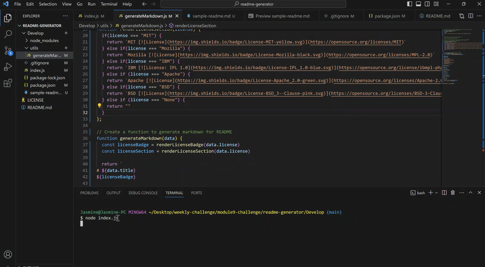
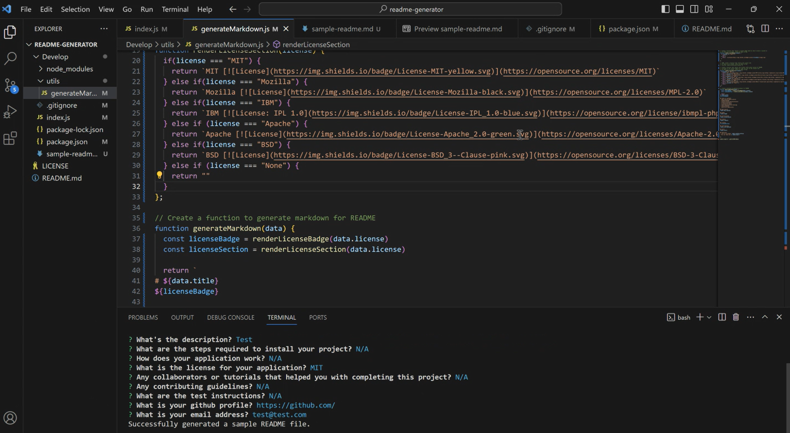
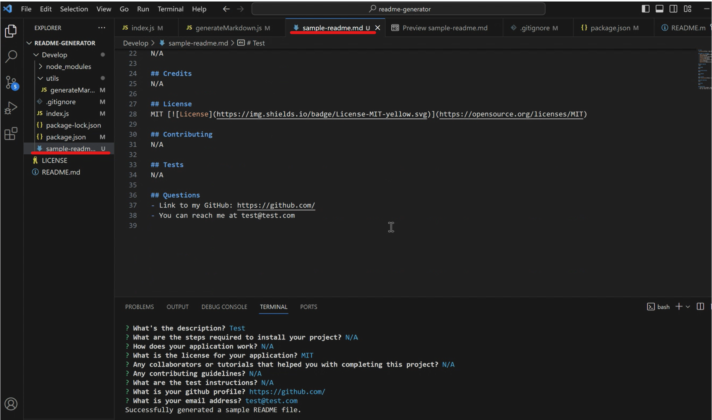
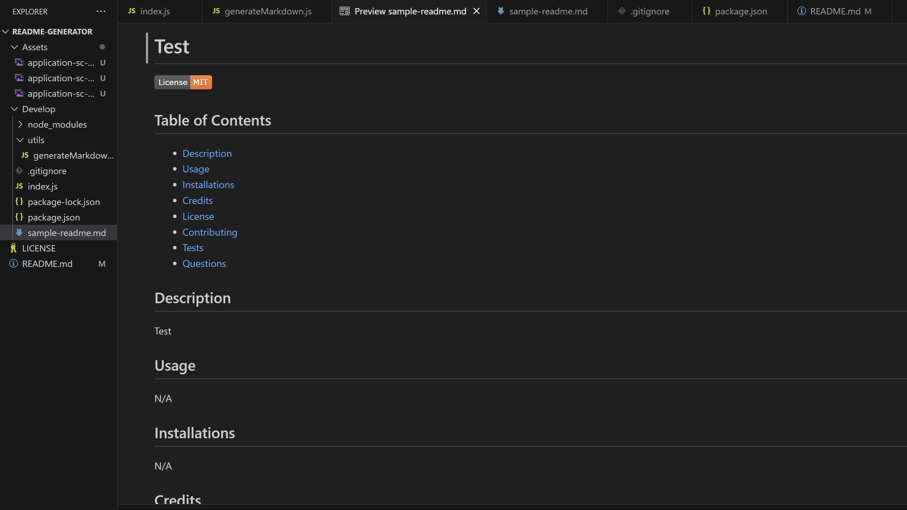

# Readme Generator

## Description
A command-line application that generates a README file based on user's inputs.

## Installation
Nods.js https://nodejs.org/en

## Usage
Steps:
1. Type in the command "node index.js" in the terminal

2. Answer all the questions prompted -- you should see the message "Successfully generated a sample README file." after answering the questions.

3. A file named sample-readme.md has been generated based on your inputs.

## Credits
Starter code is from: https://github.com/coding-boot-camp/potential-enigma

License badges and links are from: https://gist.github.com/lukas-h/2a5d00690736b4c3a7ba

## License
Please refer to the LICENSE in the repo.